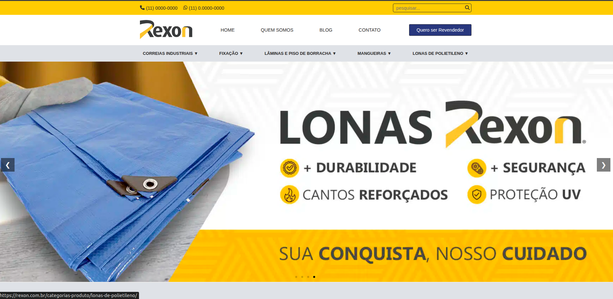

# Projeto de Reprodução do Site Rexon

# deploy [Aqui!](https://deleon-santos.github.io/rexon/)

### Visão Geral

Este projeto consiste na reconstrução da interface inicial do site de **Daisan Produtos Industriais** originalmente desenvolvido utilizando **WordPress** para uma estrutura baseada em tecnologias fundamentais do desenvolvimento web:

* HTML5
* CSS3
* JavaScript
* Font Awesome
* JSON para carregamento de informações dinâmicas

O objetivo principal não foi apenas reproduzir visualmente as páginas, mas compreender como uma interface existente poderia ser analisada, estruturada e reconstruída manualmente, sem depender do CMS utilizado no projeto original.

A aplicação atualmente reproduz a estrutura principal da página inicial, incluindo cabeçalho, navegação, menu de categorias, banner/carrossel, seção de distribuidores, áreas informativas, formulário de contato e rodapé.

A estrutura HTML utiliza `viewport` para configuração inicial da visualização em diferentes dispositivos e mantém os arquivos CSS organizados por responsabilidade.

---

# Objetivo do Projeto

O objetivo do projeto é refatorar uma versão independente da interface originalmente disponibilizada com WordPress.
**Todas as imagens e informações foram baixadas ou linkadas dos site original ou de seus assossiados**.

A proposta envolve:

1. Analisar a estrutura visual do site original.
2. Identificar seus principais componentes.
3. Reproduzir a estrutura utilizando HTML sem depender do construtor do WordPress.
4. Desenvolver a identidade visual utilizando CSS.
5. Implementar interações utilizando JavaScript.
6. Organizar os componentes de forma modular.
7. Preparar a aplicação para futuras integrações externas.
8. Adaptar a interface para dispositivos móveis.
9. Transformar uma página originalmente dependente de um CMS em uma aplicação front-end mais controlável e personalizada.

---

# Desafio do Projeto

Um dos principais desafios foi realizar a **reprodução de uma interface já existente**.

Diferentemente de iniciar um projeto do zero, nesse cenário foi necessário observar uma aplicação pronta e tentar identificar:

* estrutura dos elementos;
* espaçamentos;
* hierarquia visual;
* tipografia;
* cores;
* comportamento dos menus;
* funcionamento dos carrosséis;
* posicionamento dos componentes;
* comportamento dos links;
* organização das seções;
* adaptação para diferentes tamanhos de tela.

Esse processo exigiu uma abordagem semelhante à engenharia reversa de uma interface.

O desafio não estava somente em escrever HTML e CSS, mas em entender **por que cada elemento estava posicionado daquela maneira e como reproduzir seu comportamento utilizando tecnologias nativas da Web**.

---

# Migração de WordPress para HTML, CSS e JavaScript

O site original utiliza WordPress como plataforma de gerenciamento de conteúdo.

Nesta versão, a proposta foi retirar a dependência direta do CMS e reconstruir a camada visual utilizando tecnologias front-end.

---

# Organização dos Arquivos

A aplicação utiliza uma divisão dos estilos em diferentes arquivos CSS.

Uma possível representação da estrutura atual é:

Essa organização permite separar responsabilidades e facilita a manutenção do projeto.

---

# JavaScript

O JavaScript é utilizado principalmente para adicionar comportamento à interface.

Atualmente existem scripts separados para funcionalidades específicas:

O `cascade.js` está relacionado ao comportamento do menu de categorias.

O `carousel.js` é responsável pelo comportamento dos carrosséis existentes na página.
O `menu-burguer` é responável interação com a navegação entre as rotas do site e categorias de produtos em dispositivos mobile.
A utilização de arquivos JavaScript separados permite evitar que toda a lógica fique concentrada em um único arquivo.

---

# Carregamento Dinâmico de Dados

Um dos pontos importantes da implementação é a utilização de um arquivo JSON para os distribuidores.

Essa abordagem apresenta um conceito importante para o desenvolvimento web:

Posteriormente, essa mesma estrutura poderá ser substituída por:

---

# Aprendizados Obtidos

O desenvolvimento do projeto proporcionou aprendizados em diferentes áreas. Foi possível aprofundar conhecimentos relacionados à:

## HTML

* estrutura semântica;
* organização de componentes;
* navegação;
* links;
* imagens;
* atributos;
* acessibilidade básica;
* estruturação de páginas.

## CSS

* Flexbox;
* Grid;
* posicionamento;
* espaçamento;
* responsividade;
* transições;
* animações;
* organização de estilos;
* componentes reutilizáveis.

## JavaScript

* manipulação do DOM;
* eventos;
* carrosséis;
* menus interativos;
* carregamento de JSON;
* comportamento dinâmico dos elementos.

---

# Próximas Etapas

O projeto ainda possui diversas possibilidades de evolução.

##  Desenvolvimento das páginas auxiliares

A próxima etapa será reproduzir outras páginas existentes no projeto original.

Entre elas:

* Quem Somos;
* Blog;
* Contato;
* Catálogo;
* Correias Industriais;
* Fixação;
* Lâminas e Piso de Borracha;
* Mangueiras;
* Lonas de Polietileno;
* Página de revendedores.

O objetivo será manter a mesma identidade visual e arquitetura utilizada na página inicial.

---

# Integrações Externas

Outra etapa futura será transformar elementos atualmente estáticos em funcionalidades reais.

Possíveis integrações:

---

# Conclusão

O projeto representa uma experiência prática de reconstrução de uma interface web originalmente desenvolvida utilizando WordPress.

O maior desafio foi reproduzir uma interface existente utilizando apenas HTML, CSS e JavaScript, exigindo a análise visual e estrutural de cada componente.

Mais do que reproduzir a aparência do site, o projeto permitiu compreender conceitos fundamentais do desenvolvimento front-end, como estruturação semântica, organização de CSS, manipulação do DOM, eventos, componentes interativos, carrosséis e carregamento dinâmico de dados.

A implementação atual representa a primeira etapa do projeto. As próximas fases envolvem a criação das páginas auxiliares, integração com APIs e serviços externos, implementação de funcionalidades reais, melhorias de acessibilidade, otimização de desempenho e adaptação completa para dispositivos móveis.

---

## Tecnologias utilizadas

| Tecnologia   | Utilização                                           |
| ------------ | ---------------------------------------------------- |
| HTML5        | Estrutura da aplicação                               |
| CSS3         | Estilização e layout                                 |
| JavaScript   | Interações e funcionalidades                         |
| JSON         | Armazenamento inicial de dados                       |
| Font Awesome | Ícones                                               |
| WordPress    | Plataforma utilizada como referência para reprodução |
